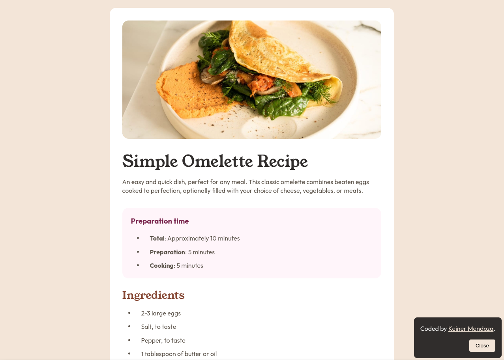

# Frontend Mentor - Recipe page solution

This is a solution to the [Recipe page challenge on Frontend Mentor](https://www.frontendmentor.io/challenges/recipe-page-KiTsR8QQKm). Frontend Mentor challenges help you improve your coding skills by building realistic projects. 

## Overview

### Screenshot

### Links

- Solution URL: [Available on Frontend Mentor](https://www.frontendmentor.io/solutions/recipe-page-using-semantic-html-css-and-bem-metodology-FpqrumT-FD)
- Live Site URL: [Hosted on Vercel](https://fm-recipe-beta.vercel.app/)

## My process

### Built with

- Semantic HTML5 markup
- CSS custom properties
- Flexbox
- CSS Grid
- CSS Media Queries
